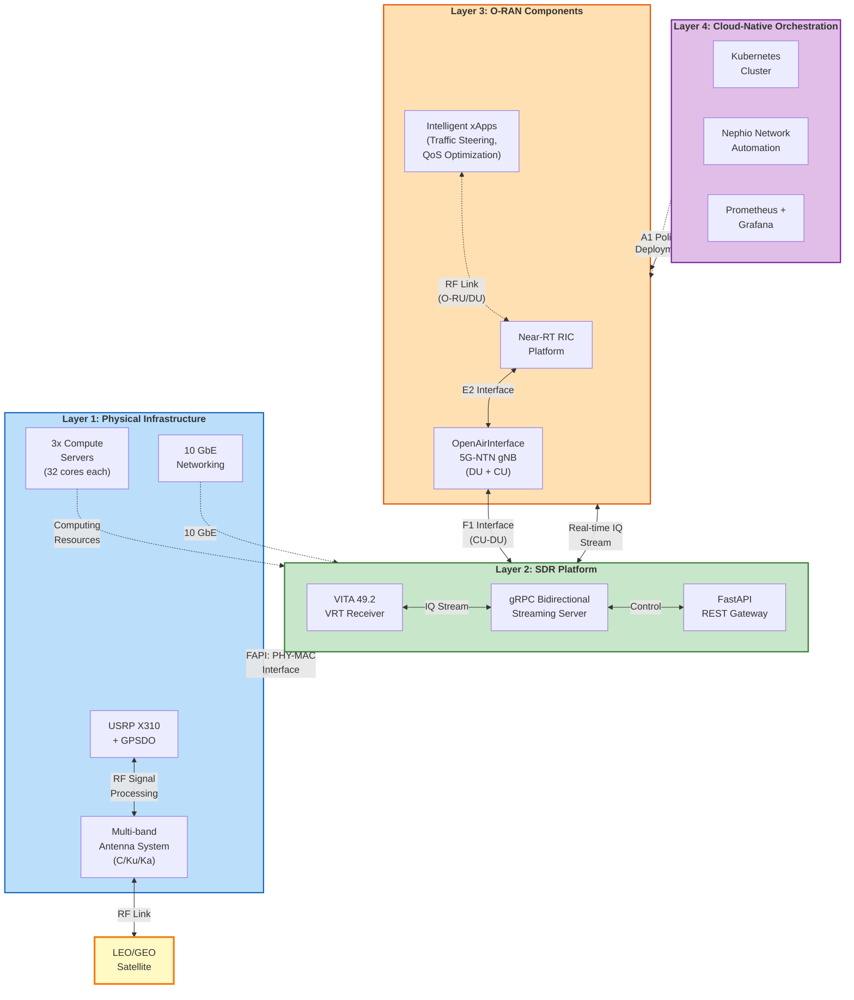

```mermaid
flowchart TB
    subgraph Layer4["<b>Layer 4: Cloud-Native Orchestration</b>"]
        direction LR
        K8S["Kubernetes<br/>Cluster"]
        NEPHIO["Nephio Network<br/>Automation"]
        MON["Prometheus +<br/>Grafana"]
    end

    subgraph Layer3["<b>Layer 3: O-RAN Components</b>"]
        direction LR
        GNB["OpenAirInterface<br/>5G-NTN gNB<br/>(DU + CU)"]
        RIC["Near-RT RIC<br/>Platform"]
        XAPP["Intelligent xApps<br/>(Traffic Steering,<br/>QoS Optimization)"]
    end

    subgraph Layer2["<b>Layer 2: SDR Platform</b>"]
        direction LR
        VRT["VITA 49.2<br/>VRT Receiver"]
        GRPC["gRPC Bidirectional<br/>Streaming Server"]
        API["FastAPI<br/>REST Gateway"]
    end

    subgraph Layer1["<b>Layer 1: Physical Infrastructure</b>"]
        direction LR
        USRP["USRP X310<br/>+ GPSDO"]
        ANT["Multi-band<br/>Antenna System<br/>(C/Ku/Ka)"]
        COMP["3x Compute<br/>Servers<br/>(32 cores each)"]
        NET["10 GbE<br/>Networking"]
    end

    SAT["LEO/GEO<br/>Satellite"]

    %% Connections from top to bottom
    Layer4 -.->|"A1 Policy"| Layer3
    Layer4 -.->|"Deployment"| Layer3

    RIC <-->|"E2 Interface"| GNB
    XAPP <-.->|"RF Link<br/>(O-RU/DU)"| RIC

    GNB <-->|"F1 Interface<br/>(CU-DU)"| Layer2
    Layer3 <-->|"Real-time IQ<br/>Stream"| Layer2

    Layer2 <-->|"FAPI: PHY-MAC<br/>Interface"| Layer1
    VRT <-->|"IQ Stream"| GRPC
    GRPC <-->|"Control"| API

    USRP <-->|"RF Signal<br/>Processing"| ANT
    ANT <-->|"RF Link"| SAT
    COMP -.->|"Computing<br/>Resources"| Layer2
    NET -.->|"10 GbE"| Layer2

    %% Styling
    classDef layer4Style fill:#E1BEE7,stroke:#7B1FA2,stroke-width:2px
    classDef layer3Style fill:#FFE0B2,stroke:#E65100,stroke-width:2px
    classDef layer2Style fill:#C8E6C9,stroke:#2E7D32,stroke-width:2px
    classDef layer1Style fill:#BBDEFB,stroke:#1565C0,stroke-width:2px
    classDef satStyle fill:#FFF9C4,stroke:#F57F17,stroke-width:3px

    class Layer4 layer4Style
    class Layer3 layer3Style
    class Layer2 layer2Style
    class Layer1 layer1Style
    class SAT satStyle
```
