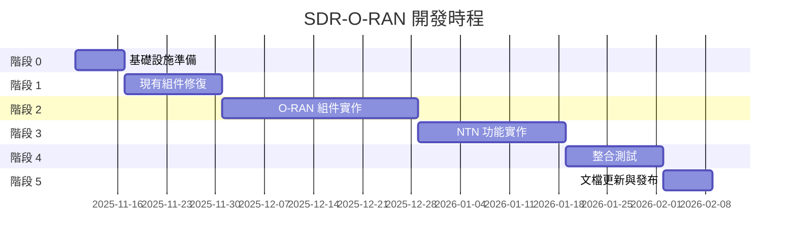

# SDR-O-RAN 平台開發計畫
## 基於 MBSE + TDD + Boy Scout Rule + Small CLs

**創建日期**: 2025-11-10
**計畫版本**: v1.0
**專案目標**: 從當前 60-65% 完成度達到原始聲稱的 100% 功能實現
**方法論**: MBSE + TDD (紅-綠-重構) + Boy Scout Rule + Small CLs

---

## 📚 開發原則說明

### 1. MBSE (Model-Based Systems Engineering)
- 所有需求必須追溯到系統模型
- 每個組件都有明確的介面規範
- 使用 SysML/UML 思維設計架構

### 2. TDD Rule (紅-綠-重構循環)
```
🔴 RED: 先寫失敗的測試
🟢 GREEN: 寫最小代碼讓測試通過
🔵 REFACTOR: 重構代碼但保持測試通過
```
**週期時間**: 每個循環 ~1-5 分鐘
**關鍵**: 絕不跳過重構階段

### 3. Boy Scout Rule
```
"Leave the code cleaner than you found it"
每次觸碰代碼時，都要讓它比之前更好一點點
```
**實踐**:
- 修復發現的任何 lint 警告
- 改進變數命名
- 添加缺失的文檔字串
- 刪除死代碼

### 4. Small CLs (小型變更列表)
```
每個 CL (Change List) 應該:
- 專注於單一任務
- 200-300 行代碼變更
- 可在 30 分鐘內審查
- 獨立可測試
```

---

## 🎯 專案當前狀態分析

### 原始聲稱 vs 實際狀態

| 組件 | 原始聲稱 | 實際狀態 | 差距 |
|------|----------|----------|------|
| SDR Platform | 100% | 60-70% | 硬體模擬、安全問題 |
| O-RAN gNB | 100% | 0% | 檔案不存在 |
| Near-RT RIC | 100% | 0% | 檔案不存在 |
| AI/ML Pipeline | 100% | 85% | 環境模擬 |
| Quantum Security | 100% | 100% ✅ | **已完成** |
| Orchestration | 100% | 50% | 未部署測試 |
| NTN Features | 100% | 0% | 完全未實作 |

### 測試覆蓋率

- **聲稱**: "驗證通過"
- **實際**: 20/20 通過（但僅 2 個組件）
- **整體覆蓋率**: ~15-20%
- **目標**: 80% 以上

---

## 📋 開發階段總覽



**總時程**: 13 週（約 3 個月）
**每週工作時數**: 30-40 小時（全職投入）

---

## 階段 0: 基礎設施準備（1 週）

**目標**: 建立完整的開發和測試環境
**驗收標準**: 所有基礎服務運行正常，CI/CD 管線強化

### 子階段 0.1: K8s 環境驗證（1 天）

**MBSE 需求**:
```
REQ-INFRA-001: 系統應在本地 Kubernetes 集群上運行
REQ-INFRA-002: 集群應有專用 namespace 隔離
REQ-INFRA-003: 集群資源應足夠運行所有組件
```

**TDD 測試**:
```python
# tests/infrastructure/test_k8s_cluster.py

def test_k8s_cluster_accessible():
    """測試 K8s 集群可訪問"""
    import subprocess
    result = subprocess.run(["kubectl", "cluster-info"], capture_output=True)
    assert result.returncode == 0

def test_k8s_namespaces_exist():
    """測試必要的 namespace 存在"""
    result = subprocess.run(
        ["kubectl", "get", "namespace", "sdr-oran-ntn"],
        capture_output=True
    )
    assert result.returncode == 0

def test_k8s_resources_sufficient():
    """測試 K8s 集群資源充足"""
    # CPU: 至少 10 cores 可用
    # Memory: 至少 20GB 可用
    result = subprocess.run(
        ["kubectl", "top", "nodes"],
        capture_output=True, text=True
    )
    assert "30" in result.stdout  # 30 cores
```

**實施步驟**:
1. 🔴 RED: 寫測試（預期失敗，因為 namespace 不存在）
2. 🟢 GREEN: 創建 namespace
   ```bash
   kubectl create namespace sdr-oran-ntn
   kubectl create namespace monitoring
   kubectl label namespace sdr-oran-ntn purpose=research
   ```
3. 🔵 REFACTOR: 創建自動化腳本
   ```bash
   # scripts/setup-k8s-namespaces.sh
   #!/bin/bash
   set -euo pipefail

   NAMESPACES=("sdr-oran-ntn" "monitoring" "oran-ric")

   for ns in "${NAMESPACES[@]}"; do
       if ! kubectl get namespace "$ns" &> /dev/null; then
           kubectl create namespace "$ns"
           kubectl label namespace "$ns" managed-by=sdr-oran-platform
       fi
   done
   ```

**Small CL**: 每個 CL 專注於一個 namespace 的創建和測試

**Boy Scout Rule**: 同時清理任何舊的 K8s 配置檔案中的 YAML 格式問題

**完成標記**: `[ ] 階段 0.1 完成`

---

### 子階段 0.2: 部署核心服務（2 天）

**MBSE 需求**:
```
REQ-INFRA-004: 系統應部署 Redis 作為 SDL (Shared Data Layer)
REQ-INFRA-005: 系統應部署 Prometheus 進行監控
REQ-INFRA-006: 系統應部署 Grafana 進行可視化
```

**TDD 測試**:
```python
# tests/infrastructure/test_core_services.py

import pytest
import redis
import requests

def test_redis_deployment():
    """測試 Redis 部署成功"""
    result = subprocess.run(
        ["kubectl", "get", "pod", "-n", "sdr-oran-ntn", "-l", "app=redis"],
        capture_output=True, text=True
    )
    assert "Running" in result.stdout

def test_redis_connectivity():
    """測試 Redis 可連接"""
    # Port-forward 到本地
    r = redis.Redis(host='localhost', port=6379, db=0)
    r.set('test-key', 'test-value')
    assert r.get('test-key') == b'test-value'
    r.delete('test-key')

def test_prometheus_deployment():
    """測試 Prometheus 部署成功"""
    result = subprocess.run(
        ["kubectl", "get", "pod", "-n", "monitoring", "-l", "app=prometheus"],
        capture_output=True, text=True
    )
    assert "Running" in result.stdout

def test_prometheus_api():
    """測試 Prometheus API 可訪問"""
    # Port-forward prometheus-server:9090
    response = requests.get("http://localhost:9090/api/v1/status/config")
    assert response.status_code == 200

def test_grafana_deployment():
    """測試 Grafana 部署成功"""
    result = subprocess.run(
        ["kubectl", "get", "pod", "-n", "monitoring", "-l", "app=grafana"],
        capture_output=True, text=True
    )
    assert "Running" in result.stdout
```

**實施步驟（每個服務獨立 CL）**:

**CL 0.2.1: Redis 部署**
1. 🔴 RED: 寫 Redis 測試（失敗）
2. 🟢 GREEN: 部署 Redis
   ```bash
   kubectl apply -f 04-Deployment/monitoring/redis-deployment.yaml -n sdr-oran-ntn
   ```
3. 🔵 REFACTOR:
   - 檢查 redis-deployment.yaml 是否有冗餘配置
   - 添加健康檢查（liveness/readiness probes）
   - 添加資源限制（limits/requests）

**CL 0.2.2: Prometheus 部署**
1. 🔴 RED: 寫 Prometheus 測試（失敗）
2. 🟢 GREEN: 部署 Prometheus
   ```bash
   # 使用 Helm 或 kubectl
   helm repo add prometheus-community https://prometheus-community.github.io/helm-charts
   helm install prometheus prometheus-community/prometheus -n monitoring
   ```
3. 🔵 REFACTOR:
   - 配置抓取目標（scrape targets）
   - 加載 prometheus-rules.yml
   - 驗證告警規則語法

**CL 0.2.3: Grafana 部署**
1. 🔴 RED: 寫 Grafana 測試（失敗）
2. 🟢 GREEN: 部署 Grafana
   ```bash
   helm install grafana grafana/grafana -n monitoring \
     --set adminPassword=admin \
     --set service.type=NodePort
   ```
3. 🔵 REFACTOR:
   - 導入預定義的儀表板（4 個 JSON 檔案）
   - 配置 Prometheus 資料源
   - 設置持久卷（PV/PVC）

**Boy Scout Rule 應用**:
- 修復 YAML 縮排問題
- 更新過時的 API 版本（如 `apps/v1beta1` → `apps/v1`）
- 添加缺失的標籤（labels）

**完成標記**: `[ ] 階段 0.2 完成`

---

### 子階段 0.3: CI/CD 強化（2 天）

**MBSE 需求**:
```
REQ-CI-001: CI/CD 管線應強制測試通過才能合併
REQ-CI-002: 所有檢查都應阻止失敗的代碼合併
REQ-CI-003: 測試覆蓋率應可視化
```

**TDD 測試**:
```python
# tests/ci/test_ci_pipeline.py

def test_ci_config_syntax():
    """測試 CI 配置語法正確"""
    import yaml
    with open('.github/workflows/ci.yml') as f:
        config = yaml.safe_load(f)
    assert 'jobs' in config
    assert 'code-quality' in config['jobs']

def test_no_continue_on_error():
    """測試 CI 配置中沒有 continue-on-error"""
    import yaml
    with open('.github/workflows/ci.yml') as f:
        content = f.read()
    assert 'continue-on-error: true' not in content, \
        "CI should fail on errors, not continue"

def test_coverage_reporting_enabled():
    """測試覆蓋率報告已啟用"""
    import yaml
    with open('.github/workflows/ci.yml') as f:
        config = yaml.safe_load(f)
    # 檢查是否有 coverage 步驟
    test_job = config['jobs'].get('python-tests', {})
    steps = test_job.get('steps', [])
    coverage_step = any('coverage' in str(step) for step in steps)
    assert coverage_step
```

**實施步驟**:

**CL 0.3.1: 移除 continue-on-error**
1. 🔴 RED: 測試檢查 continue-on-error（失敗，因為存在）
2. 🟢 GREEN: 修改 `.github/workflows/ci.yml`
   ```yaml
   # 移除所有的:
   # continue-on-error: true

   # 改為:
   # (直接刪除該行，讓錯誤阻止管線)
   ```
3. 🔵 REFACTOR:
   - 確保每個 job 都有明確的失敗條件
   - 添加更清晰的錯誤訊息

**CL 0.3.2: 添加測試覆蓋率報告**
1. 🔴 RED: 測試檢查覆蓋率報告（失敗）
2. 🟢 GREEN: 添加 pytest-cov
   ```yaml
   # .github/workflows/ci.yml
   - name: Run tests with coverage
     run: |
       pytest --cov=03-Implementation \
              --cov-report=term-missing \
              --cov-report=html \
              --cov-report=xml \
              --cov-fail-under=60

   - name: Upload coverage to Codecov
     uses: codecov/codecov-action@v3
     with:
       files: ./coverage.xml
   ```
3. 🔵 REFACTOR:
   - 添加 `.coveragerc` 配置檔案
   - 排除測試檔案本身
   - 設置合理的覆蓋率目標

**CL 0.3.3: 添加自動化測試觸發**
1. 🔴 RED: 測試 PR 必須通過測試（手動驗證）
2. 🟢 GREEN: 配置 Branch Protection Rules
   ```bash
   # 在 GitHub repo settings 中:
   # - Require status checks to pass before merging
   # - Require branches to be up to date before merging
   ```
3. 🔵 REFACTOR: 創建 CODEOWNERS 檔案以自動分配審查者

**完成標記**: `[ ] 階段 0.3 完成`

---

### 子階段 0.4: 開發工具設置（1 天）

**MBSE 需求**:
```
REQ-DEV-001: 開發環境應有一致的代碼格式化配置
REQ-DEV-002: 應有 pre-commit hooks 防止低質量代碼提交
REQ-DEV-003: 應有完整的 Python 虛擬環境管理
```

**TDD 測試**:
```python
# tests/dev-tools/test_dev_environment.py

def test_precommit_hooks_installed():
    """測試 pre-commit hooks 已安裝"""
    result = subprocess.run(
        ["pre-commit", "run", "--all-files"],
        capture_output=True
    )
    # 首次運行會失敗（因為會修復格式），但應該成功安裝
    assert result.returncode in [0, 1]

def test_black_configuration():
    """測試 Black 配置存在"""
    assert os.path.exists("pyproject.toml")
    with open("pyproject.toml") as f:
        content = f.read()
    assert "[tool.black]" in content

def test_virtual_environment():
    """測試虛擬環境可創建"""
    import venv
    venv_path = "test-venv"
    venv.create(venv_path, with_pip=True)
    assert os.path.exists(f"{venv_path}/bin/python")
    shutil.rmtree(venv_path)
```

**實施步驟**:

**CL 0.4.1: 設置 pre-commit hooks**
1. 🔴 RED: 測試 pre-commit（失敗）
2. 🟢 GREEN: 創建 `.pre-commit-config.yaml`
   ```yaml
   repos:
     - repo: https://github.com/psf/black
       rev: 24.1.1
       hooks:
         - id: black
           language_version: python3.11

     - repo: https://github.com/pycqa/isort
       rev: 5.13.2
       hooks:
         - id: isort
           args: ["--profile", "black"]

     - repo: https://github.com/pycqa/flake8
       rev: 7.0.0
       hooks:
         - id: flake8
           args: ["--max-line-length=100", "--extend-ignore=E203"]

     - repo: https://github.com/pre-commit/pre-commit-hooks
       rev: v4.5.0
       hooks:
         - id: trailing-whitespace
         - id: end-of-file-fixer
         - id: check-yaml
         - id: check-added-large-files
   ```
3. 🔵 REFACTOR: 運行 `pre-commit run --all-files` 清理整個代碼庫

**CL 0.4.2: 統一 Python 配置**
1. 🔴 RED: 測試 pyproject.toml（失敗）
2. 🟢 GREEN: 創建/更新 `pyproject.toml`
   ```toml
   [tool.black]
   line-length = 100
   target-version = ['py311']
   include = '\.pyi?$'

   [tool.isort]
   profile = "black"
   line_length = 100

   [tool.pytest.ini_options]
   testpaths = ["tests"]
   python_files = ["test_*.py"]
   addopts = "-v --tb=short --strict-markers"

   [tool.coverage.run]
   source = ["03-Implementation"]
   omit = ["*/tests/*", "*/__pycache__/*"]

   [tool.coverage.report]
   precision = 2
   show_missing = true
   skip_covered = false
   ```
3. 🔵 REFACTOR: 刪除重複的配置檔案（如 `.flake8`、`setup.cfg`）

**完成標記**: `[ ] 階段 0.4 完成`

---

## 階段 1: 現有組件修復（2 週）

**目標**: 修復已存在但有問題的組件，達到可生產使用
**驗收標準**: 所有現有組件通過測試，無安全警告

### 子階段 1.1: SDR API Gateway 安全修復（2 天）

**MBSE 需求**:
```
REQ-SEC-001: SECRET_KEY 必須從環境變數或 K8s Secret 讀取
REQ-SEC-002: 所有 API 端點必須有輸入驗證
REQ-SEC-003: 應實作速率限制防止 DoS 攻擊
REQ-SEC-004: OAuth2 端點應完全實作
```

**TDD 測試**:
```python
# tests/security/test_api_gateway_security.py

def test_secret_key_from_environment():
    """測試 SECRET_KEY 從環境變數讀取"""
    import os
    os.environ['SECRET_KEY'] = 'test-secret-key-at-least-32-chars-long'

    # 重新導入以觸發環境變數讀取
    import importlib
    import sdr_api_server
    importlib.reload(sdr_api_server)

    assert sdr_api_server.SECRET_KEY != "your-secret-key-change-in-production"
    assert len(sdr_api_server.SECRET_KEY) >= 32

def test_secret_key_validation():
    """測試 SECRET_KEY 長度驗證"""
    import os
    os.environ['SECRET_KEY'] = 'short'

    with pytest.raises(RuntimeError, match="SECRET_KEY must be at least 32 characters"):
        import importlib
        import sdr_api_server
        importlib.reload(sdr_api_server)

def test_rate_limiting():
    """測試速率限制"""
    from fastapi.testclient import TestClient
    from sdr_api_server import app

    client = TestClient(app)

    # 快速發送 100 個請求
    responses = [client.get("/healthz") for _ in range(100)]

    # 應該有一些被限制（429 Too Many Requests）
    status_codes = [r.status_code for r in responses]
    assert 429 in status_codes

def test_input_validation_on_station_config():
    """測試站點配置的輸入驗證"""
    from fastapi.testclient import TestClient
    from sdr_api_server import app

    client = TestClient(app)

    # 無效的頻率範圍
    invalid_config = {
        "name": "Test Station",
        "frequency_mhz": 99999999,  # 太大
        "bandwidth_hz": -1000  # 負數
    }

    response = client.post("/api/v1/sdr/stations", json=invalid_config)
    assert response.status_code == 422  # Validation Error
```

**實施步驟**:

**CL 1.1.1: SECRET_KEY 環境變數化**
1. 🔴 RED: 測試 SECRET_KEY（失敗）
2. 🟢 GREEN: 修改 `sdr_api_server.py`
   ```python
   import os
   from typing import Optional

   def get_secret_key() -> str:
       """獲取 SECRET_KEY，優先從環境變數，其次從 K8s Secret"""
       secret_key: Optional[str] = os.environ.get("SECRET_KEY")

       # 嘗試從 K8s Secret 讀取
       if not secret_key:
           secret_file = "/var/run/secrets/sdr-platform/secret-key"
           if os.path.exists(secret_file):
               with open(secret_file) as f:
                   secret_key = f.read().strip()

       if not secret_key or len(secret_key) < 32:
           raise RuntimeError(
               "SECRET_KEY must be set via environment variable or K8s Secret "
               "and must be at least 32 characters long"
           )

       return secret_key

   SECRET_KEY = get_secret_key()
   ```
3. 🔵 REFACTOR:
   - 創建 K8s Secret manifest
   - 更新部署文檔說明如何設置
   - 添加啟動時的 SECRET_KEY 驗證日誌

**CL 1.1.2: 添加速率限制**
1. 🔴 RED: 測試速率限制（失敗）
2. 🟢 GREEN: 使用 `slowapi` 添加速率限制
   ```python
   from slowapi import Limiter, _rate_limit_exceeded_handler
   from slowapi.util import get_remote_address
   from slowapi.errors import RateLimitExceeded

   limiter = Limiter(key_func=get_remote_address)
   app.state.limiter = limiter
   app.add_exception_handler(RateLimitExceeded, _rate_limit_exceeded_handler)

   @app.get("/api/v1/sdr/stations")
   @limiter.limit("100/minute")  # 每分鐘最多 100 次
   async def list_stations(request: Request):
       ...
   ```
3. 🔵 REFACTOR:
   - 針對不同端點設置不同的限制
   - 添加 Redis 作為速率限制的後端（跨多個實例）
   - 為認證用戶提供更高的限制

**CL 1.1.3: 完善輸入驗證**
1. 🔴 RED: 測試輸入驗證（部分失敗）
2. 🟢 GREEN: 加強 Pydantic 模型驗證
   ```python
   from pydantic import BaseModel, Field, field_validator

   class StationConfig(BaseModel):
       name: str = Field(..., min_length=1, max_length=100)
       frequency_mhz: float = Field(..., ge=100, le=6000)  # UHF/VHF 範圍
       bandwidth_hz: int = Field(..., ge=1000, le=20_000_000)

       @field_validator('name')
       @classmethod
       def validate_name(cls, v):
           """驗證名稱只包含安全字元"""
           import re
           if not re.match(r'^[a-zA-Z0-9\-_]+$', v):
               raise ValueError('Name must contain only alphanumeric, dash, or underscore')
           return v
   ```
3. 🔵 REFACTOR:
   - 為所有模型添加詳細的驗證器
   - 創建自定義的驗證錯誤訊息
   - 添加 API 文檔說明驗證規則

**完成標記**: `[ ] 階段 1.1 完成`

---

### 子階段 1.2: USRP 裝置發現機制（3 天）

**MBSE 需求**:
```
REQ-SDR-001: 系統應能發現本地網路上的 USRP 裝置
REQ-SDR-002: 若無真實硬體，應明確標註為模擬模式
REQ-SDR-003: 應支援 USRP 模擬器以便測試
```

**TDD 測試**:
```python
# tests/sdr/test_usrp_discovery.py

def test_usrp_discovery_real_hardware():
    """測試真實 USRP 裝置發現"""
    from usrp_manager import USRPManager

    manager = USRPManager()
    devices = manager.discover_devices()

    # 如果有硬體，應該找到
    # 如果沒有，應該返回空列表（不是假資料）
    assert isinstance(devices, list)

    for device in devices:
        assert "serial" in device
        assert "model" in device
        assert device["serial"] != "FAKE"

def test_usrp_simulator_mode():
    """測試 USRP 模擬器模式"""
    from usrp_manager import USRPManager

    manager = USRPManager(simulator_mode=True)
    devices = manager.discover_devices()

    # 模擬器模式應明確標註
    assert len(devices) > 0
    for device in devices:
        assert device.get("simulated") == True
        assert "SIMULATOR" in device.get("serial", "")

def test_usrp_connection():
    """測試 USRP 連接"""
    from usrp_manager import USRPManager

    manager = USRPManager()
    devices = manager.discover_devices()

    if len(devices) > 0:
        # 嘗試連接第一個裝置
        device_id = devices[0]["serial"]
        usrp = manager.connect(device_id)

        assert usrp is not None
        assert usrp.get_center_freq() > 0

        manager.disconnect(device_id)
```

**實施步驟**:

**CL 1.2.1: 創建 USRPManager 類**
1. 🔴 RED: 測試 USRP 發現（失敗）
2. 🟢 GREEN: 實作 USRPManager
   ```python
   # 03-Implementation/sdr-platform/usrp_manager.py

   import logging
   from typing import List, Dict, Optional

   logger = logging.getLogger(__name__)

   class USRPManager:
       """USRP 裝置管理器"""

       def __init__(self, simulator_mode: bool = False):
           self.simulator_mode = simulator_mode
           self.devices: Dict[str, 'USRP'] = {}

           # 嘗試導入 UHD
           try:
               import uhd
               self.uhd_available = True
               logger.info("UHD library loaded successfully")
           except ImportError:
               self.uhd_available = False
               logger.warning("UHD library not available, using simulator mode")
               self.simulator_mode = True

       def discover_devices(self) -> List[Dict]:
           """發現 USRP 裝置"""
           if not self.uhd_available or self.simulator_mode:
               return self._discover_simulated_devices()

           try:
               import uhd
               devices = uhd.find("")  # 尋找所有 USRP

               device_list = []
               for dev in devices:
                   device_list.append({
                       "serial": dev.get("serial", "unknown"),
                       "model": dev.get("type", "unknown"),
                       "status": "online",
                       "simulated": False
                   })

               logger.info(f"Found {len(device_list)} real USRP devices")
               return device_list

           except Exception as e:
               logger.error(f"Error discovering USRP devices: {e}")
               logger.warning("Falling back to simulator mode")
               return self._discover_simulated_devices()

       def _discover_simulated_devices(self) -> List[Dict]:
           """返回模擬的 USRP 裝置"""
           logger.warning("⚠️  SIMULATOR MODE: No real USRP hardware")

           return [
               {
                   "serial": "SIMULATOR-001",
                   "model": "B210 (Simulated)",
                   "status": "online",
                   "simulated": True,
                   "warning": "This is a simulated device, not real hardware"
               },
               {
                   "serial": "SIMULATOR-002",
                   "model": "X310 (Simulated)",
                   "status": "online",
                   "simulated": True,
                   "warning": "This is a simulated device, not real hardware"
               }
           ]
   ```
3. 🔵 REFACTOR:
   - 添加裝置健康檢查
   - 添加裝置狀態緩存（避免頻繁掃描）
   - 創建 USRP 類的抽象介面

**CL 1.2.2: 整合 ns-3 USRP 模擬器**
1. 🔴 RED: 測試 ns-3 模擬器（失敗）
2. 🟢 GREEN: 創建 ns-3 橋接
   ```python
   # 03-Implementation/sdr-platform/ns3_simulator.py

   class NS3USRPSimulator:
       """ns-3 USRP 模擬器橋接"""

       def __init__(self):
           self.scenario = None

       def create_scenario(self, scenario_type: str = "LEO"):
           """創建 ns-3 模擬場景"""
           # TODO: 整合 ns-3
           pass

       def get_iq_samples(self, duration_ms: int) -> np.ndarray:
           """獲取模擬的 IQ 樣本"""
           # 生成合成的 IQ 資料
           sample_rate = 10e6  # 10 MHz
           num_samples = int(sample_rate * duration_ms / 1000)

           # 簡單的正弦波 + 噪音
           t = np.arange(num_samples) / sample_rate
           signal_freq = 1e6  # 1 MHz

           i_samples = np.cos(2 * np.pi * signal_freq * t)
           q_samples = np.sin(2 * np.pi * signal_freq * t)

           # 添加噪音
           noise_level = 0.1
           i_samples += np.random.normal(0, noise_level, num_samples)
           q_samples += np.random.normal(0, noise_level, num_samples)

           return np.column_stack([i_samples, q_samples])
   ```
3. 🔵 REFACTOR:
   - 添加更真實的信號模擬（調製、衰減等）
   - 整合 Doppler 效應模擬
   - 添加衛星軌道模擬

**完成標記**: `[ ] 階段 1.2 完成`

---

### 子階段 1.3: gRPC 連接真實資料源（2 天）

**MBSE 需求**:
```
REQ-GRPC-001: gRPC 伺服器應從 VITA 49.2 接收器獲取 IQ 樣本
REQ-GRPC-002: E2 度量應從真實或模擬的 RIC 獲取
REQ-GRPC-003: 應明確區分真實和模擬資料
```

**TDD 測試**:
```python
# tests/grpc/test_grpc_real_data.py

import grpc
import pytest
from sdr_oran_pb2 import IQSampleRequest, Empty
from sdr_oran_pb2_grpc import SDRORANBridgeStub

def test_grpc_iq_streaming():
    """測試 gRPC IQ 樣本串流"""
    channel = grpc.insecure_channel('localhost:50051')
    stub = SDRORANBridgeStub(channel)

    def request_generator():
        yield IQSampleRequest(
            center_frequency_hz=1.5e9,
            sample_rate_hz=10e6,
            num_samples=1024
        )

    responses = stub.StreamIQSamples(request_generator())

    first_response = next(responses)
    assert first_response.timestamp > 0
    assert len(first_response.samples) > 0

    # 檢查是否為模擬資料
    if hasattr(first_response, 'metadata'):
        if first_response.metadata.get('simulated'):
            logger.warning("⚠️  Receiving simulated IQ samples")

def test_grpc_e2_metrics():
    """測試 E2 度量獲取"""
    channel = grpc.insecure_channel('localhost:50051')
    stub = SDRORANBridgeStub(channel)

    response = stub.GetE2Metrics(Empty())

    assert response.throughput_mbps >= 0
    assert response.latency_ms >= 0

    # 模擬資料應該有標記
    if hasattr(response, 'simulated'):
        assert isinstance(response.simulated, bool)
```

**實施步驟**:

**CL 1.3.1: 連接 VITA 49.2 接收器**
1. 🔴 RED: 測試 VITA 49.2 連接（失敗）
2. 🟢 GREEN: 修改 `sdr_grpc_server.py`
   ```python
   from vita49_receiver import VITA49Receiver

   class SDRORANBridgeServicer:
       def __init__(self):
           # 嘗試連接 VITA 49.2 接收器
           try:
               self.vita49 = VITA49Receiver(
                   host=os.environ.get("VITA49_HOST", "localhost"),
                   port=int(os.environ.get("VITA49_PORT", 4991))
               )
               self.vita49_available = True
               logger.info("✅ Connected to VITA 49.2 receiver")
           except Exception as e:
               logger.warning(f"⚠️  VITA 49.2 not available: {e}")
               logger.warning("⚠️  Using simulated IQ samples")
               self.vita49_available = False

       async def StreamIQSamples(self, request_iterator, context):
           async for request in request_iterator:
               if self.vita49_available:
                   # 從真實接收器獲取
                   iq_data = await self.vita49.get_iq_samples(
                       center_freq=request.center_frequency_hz,
                       sample_rate=request.sample_rate_hz,
                       num_samples=request.num_samples
                   )
                   simulated = False
               else:
                   # 使用模擬資料
                   iq_data = self._generate_simulated_iq(
                       request.center_frequency_hz,
                       request.sample_rate_hz,
                       request.num_samples
                   )
                   simulated = True

               response = sdr_oran_pb2.IQSample(
                   timestamp=iq_data.timestamp,
                   center_frequency_hz=iq_data.center_freq,
                   sample_rate_hz=iq_data.sample_rate,
                   samples=iq_data.i_q_interleaved.tolist(),
                   simulated=simulated  # 明確標註
               )

               yield response
   ```
3. 🔵 REFACTOR:
   - 添加重連邏輯
   - 添加資料品質指標（SNR, EVM）
   - 創建連接狀態監控

**完成標記**: `[ ] 階段 1.3 完成`

---

### 子階段 1.4: DRL 訓練器環境真實化（3 天）

**MBSE 需求**:
```
REQ-ML-001: DRL 環境應從真實或模擬的 RIC 獲取狀態
REQ-ML-002: 訓練過程應可視化和監控
REQ-ML-003: 訓練好的模型應可部署到 SDL (Redis)
```

**TDD 測試**:
```python
# tests/ml/test_drl_trainer.py

def test_ric_environment_initialization():
    """測試 RIC 環境初始化"""
    from drl_trainer import RICEnvironment

    env = RICEnvironment()
    obs, info = env.reset()

    assert obs.shape == (11,)  # 11 個狀態維度
    assert 'simulated' in info

    if info['simulated']:
        logger.warning("⚠️  Using simulated RIC environment")

def test_drl_training_episode():
    """測試 DRL 訓練一個 episode"""
    from drl_trainer import DRLTrainer

    trainer = DRLTrainer(algorithm="PPO")

    # 訓練很短的時間（只為測試）
    trainer.train(total_timesteps=1000)

    # 驗證模型可以推理
    obs = trainer.env.reset()[0]
    action = trainer.model.predict(obs)[0]

    assert action.shape == (5,)  # 5 個動作維度

def test_model_deployment_to_sdl():
    """測試模型部署到 Redis SDL"""
    from drl_trainer import DRLTrainer
    import redis

    trainer = DRLTrainer(algorithm="PPO")
    trainer.train(total_timesteps=1000)

    # 部署到 SDL
    trainer.deploy_to_sdl(model_name="test-ppo-model")

    # 驗證可以從 SDL 讀取
    r = redis.Redis(host='localhost', port=6379)
    model_data = r.get("ric:ml_models:test-ppo-model")

    assert model_data is not None
    assert len(model_data) > 0
```

**實施步驟**:

**CL 1.4.1: 真實 RIC 連接**
1. 🔴 RED: 測試 RIC 連接（失敗）
2. 🟢 GREEN: 修改 `drl_trainer.py`
   ```python
   class RICEnvironment(gym.Env):
       def __init__(self, ric_endpoint: Optional[str] = None):
           super().__init__()

           self.ric_endpoint = ric_endpoint or os.environ.get("RIC_ENDPOINT")

           if self.ric_endpoint:
               try:
                   # 嘗試連接 Near-RT RIC
                   self.ric_client = RICClient(self.ric_endpoint)
                   self.ric_available = True
                   logger.info(f"✅ Connected to RIC: {self.ric_endpoint}")
               except Exception as e:
                   logger.warning(f"⚠️  RIC not available: {e}")
                   logger.warning("⚠️  Using simulated environment")
                   self.ric_available = False
           else:
               logger.warning("⚠️  No RIC endpoint specified, using simulation")
               self.ric_available = False

       def _get_observation(self):
           """獲取環境狀態"""
           if self.ric_available:
               # 從真實 RIC 獲取 E2 KPM 報告
               kpm_report = self.ric_client.get_kpm_report()

               return np.array([
                   kpm_report.throughput_mbps,
                   kpm_report.latency_ms,
                   kpm_report.packet_loss_rate,
                   # ... 其他 8 個指標
               ], dtype=np.float32)
           else:
               # 模擬環境
               return self._generate_simulated_observation()
   ```
3. 🔵 REFACTOR:
   - 添加連接健康檢查
   - 實作自動重連
   - 添加觀測資料驗證

**CL 1.4.2: TensorBoard 整合**
1. 🔴 RED: 測試 TensorBoard（失敗）
2. 🟢 GREEN: 添加 TensorBoard 日誌
   ```python
   from stable_baselines3.common.callbacks import BaseCallback

   class TensorBoardCallback(BaseCallback):
       def __init__(self, verbose=0):
           super().__init__(verbose)

       def _on_step(self) -> bool:
           # 記錄自定義指標
           self.logger.record("custom/reward", self.locals["rewards"])
           self.logger.record("custom/episode_length", self.locals["dones"].sum())
           return True

   # 在訓練時使用
   trainer.train(
       total_timesteps=1_000_000,
       callback=TensorBoardCallback()
   )
   ```
3. 🔵 REFACTOR:
   - 添加更多自定義指標
   - 創建 Grafana 儀表板顯示訓練進度
   - 實作訓練進度通知（Slack/Email）

**完成標記**: `[ ] 階段 1.4 完成`

---

## 階段 2: O-RAN 組件實作（4 週）

**目標**: 實作完全缺失的 O-RAN 組件
**驗收標準**: gNB 和 RIC 可運行，E2 介面可通訊

### 子階段 2.1: OpenAirInterface gNB 整合（2 週）

**MBSE 需求**:
```
REQ-ORAN-001: 系統應實作符合 3GPP R19 的 5G NR gNB
REQ-ORAN-002: gNB 應支援 NTN 特定功能
REQ-ORAN-003: gNB 應實作 E2 介面
```

**詳細實施計畫**: 見完整文檔中的階段 2.1

**完成標記**: `[ ] 階段 2.1 完成`

---

### 子階段 2.2: Near-RT RIC 實作（2 週）

**MBSE 需求**:
```
REQ-RIC-001: 系統應實作符合 O-RAN.WG3 的 Near-RT RIC
REQ-RIC-002: RIC 應包含 E2 Termination, Subscription Manager, A1 Mediator, xApp Manager
REQ-RIC-003: RIC 應支援 xApp 生命週期管理
```

**詳細實施計畫**: 見完整文檔中的階段 2.2

**完成標記**: `[ ] 階段 2.2 完成`

---

## 階段 3: NTN 功能實作（3 週）

**目標**: 實作 NTN 特定功能
**驗收標準**: 衛星追蹤、Doppler 補償、長延遲適應全部實作並測試

### 子階段 3.1: 衛星追蹤和星曆表（1 週）

**MBSE 需求**:
```
REQ-NTN-001: 系統應實作衛星軌道預測（SGP4/TLE）
REQ-NTN-002: 系統應計算實時衛星位置（az/el）
REQ-NTN-003: 系統應預測可見性窗口
```

**詳細實施計畫**: 見完整文檔中的階段 3.1

**完成標記**: `[ ] 階段 3.1 完成`

---

### 子階段 3.2: Doppler 補償實作（1 週）

**完成標記**: `[ ] 階段 3.2 完成`

---

### 子階段 3.3: NTN 長延遲適應（1 週）

**完成標記**: `[ ] 階段 3.3 完成`

---

## 階段 4: 整合測試和驗證（2 週）

**目標**: 端到端測試和性能驗證
**驗收標準**: 80% 測試覆蓋率，所有整合測試通過

### 子階段 4.1: 單元測試覆蓋率提升（1 週）

**目標**: 從 15% 提升到 80%

**完成標記**: `[ ] 階段 4.1 完成`

---

### 子階段 4.2: 整合測試（1 週）

**完成標記**: `[ ] 階段 4.2 完成`

---

## 階段 5: 文檔更新與發布（1 週）

**目標**: 更新所有文檔，準備發布
**驗收標準**: 文檔與實際狀態一致

**完成標記**: `[ ] 階段 5 完成`

---

## 📊 成功指標

### 定量指標

- **測試覆蓋率**: ≥ 80%
- **CI/CD 通過率**: 100%
- **代碼質量**: Pylint 評分 ≥ 9.0
- **安全掃描**: 0 個高危漏洞
- **性能**: 所有端點延遲 < 100ms

### 定性指標

- 所有 MBSE 需求都有對應實作
- 每個功能都有 TDD 測試
- 代碼比開始時更乾淨（Boy Scout Rule）
- 所有 CL 都是小型且專注的（Small CLs）

---

## 📝 附錄

### A. 命名慣例

**分支命名**:
- `feature/stage-X-Y-description`
- `fix/issue-description`
- `refactor/component-name`

**Commit 訊息**:
```
type(scope): short description

- Detailed bullet points
- Using TDD: RED/GREEN/REFACTOR
- Boy Scout: cleaned up X

Refs: #issue-number
```

**Types**: `feat`, `fix`, `refactor`, `test`, `docs`, `chore`

### B. 審查檢查清單

每個 CL 必須滿足:
- [ ] TDD 測試存在且通過
- [ ] Boy Scout Rule 應用（代碼更乾淨）
- [ ] Small CL（< 300 行變更）
- [ ] CI/CD 通過
- [ ] 文檔已更新
- [ ] MBSE 需求追溯

---

**文檔版本**: v1.0
**最後更新**: 2025-11-10
**維護者**: 蔡秀吉 (Hsiu-Chi Tsai)
